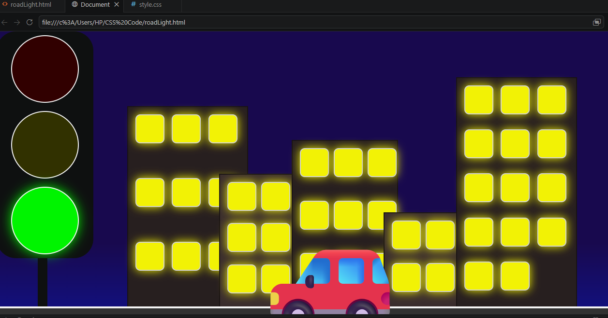

# 🚦 Traffic Light Animation

# Traffic Light Animation 🚦

### 🔗 [Live Demo](https://amritasoni-dev.github.io/Traffic-Light-Animation/roadLight.html)



A pure HTML and CSS project featuring an animated traffic signal, synchronized vehicle movement, subtle lighting effects, and a beautiful night city skyline with glowing windows.

## 🚀 How to Run Locally

1. **Clone the repository:**
   ```bash
   git clone https://github.com/amritasoni-dev/Traffic-Light-Animation.git
   ```
2. **Navigate to the project folder:**
   ```bash
   cd Traffic-Light-Animation
    ```
3. **Open in browser:**
   - Double-click `roadLight.html` 
   - Or right-click → Open with → Your browser

4. **Watch the animation:** The car will stop at red and go on green!

---  
## ✨ Features
 
* Animated traffic signal (Red, Yellow, Green)
* Moving vehicle animation
* Vehicle slows down and stops at the signal
* Night city background
* Buildings with glowing windows
* Subtle brightness effects for atmosphere
* Pure HTML & CSS (No JavaScript)

## 🛠️ Technologies Used

* HTML5
* CSS3
* CSS Animations
* Flexbox
* Keyframes
* Box Shadows

## 🎯 What I Learned

Through this project, I practiced:

* CSS positioning
* Flexbox layouts
* CSS animations
* Keyframes
* Transitions
* Z-index and layering
* Creating realistic visual effects using CSS


## 👨‍💻 Author

Amrita Soni

Aspiring Computer Science and AI Student.
